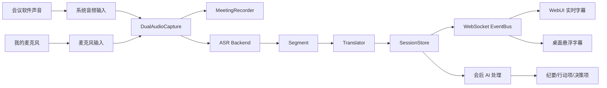

# 架构说明

## 模块划分

- `app/server.py`：FastAPI 服务、WebUI、控制 API、WebSocket 事件流。
- `app/pipeline/meeting.py`：会议任务编排，负责采集、录音、ASR、翻译、写入 Session、会后处理。
- `app/audio/`：设备检测、双轨音频采集、WAV 录音。
- `app/asr/`：本地 faster-whisper 和远端 GPU ASR 客户端。
- `app/translation/`：LLM 翻译和会后纪要生成。
- `app/pipeline/speaker.py`：基础说话人分配和可选 diarization 预留。
- `app/sessions.py`：Session 目录、逐字稿、事件日志、导出文件管理。
- `app/overlay.py`：桌面悬浮字幕客户端。
- `app/static/`：浏览器工作台。

## 运行时数据流



## Session 目录结构

```text
data/sessions/<timestamp_title>/
  session.json
  events.ndjson
  segments.ndjson
  chunks/
  exports/
    20260524_013000_客户访谈_逐字稿.txt
    20260524_013000_客户访谈_会议纪要.md
  recordings/
    system.wav
    mic.wav
    mixed.wav
```

## 安全默认

- 服务默认绑定 `127.0.0.1`。
- 本机访问默认放行；如果改成远程监听，则需要 token。
- 所有会议标题都会经过文件名清洗。
- 导出文件名包含会议开始时间和会议主题；如果没有填写主题，系统会在停止会议后从逐字稿自动推断短主题。
- 下载文件必须落在对应 Session 目录内。
- 远端 ASR 只通过显式配置的 URL 调用。

## macOS 系统音频说明

macOS 默认不能直接把系统播放声音作为输入设备。要转录会议中其他人的声音，通常需要安装并配置虚拟声卡：

- BlackHole：开源虚拟声卡，适合个人使用。
- Loopback：商业工具，适合稳定的专业音频路由。
- 聚合设备或多输出设备：用于同时把会议声音送到耳机和虚拟输入。

WebUI 会列出当前可见的输入设备，并用设备名里的 `BlackHole`、`Loopback`、`Monitor`、`Aggregate` 等关键词推测系统音频设备。
